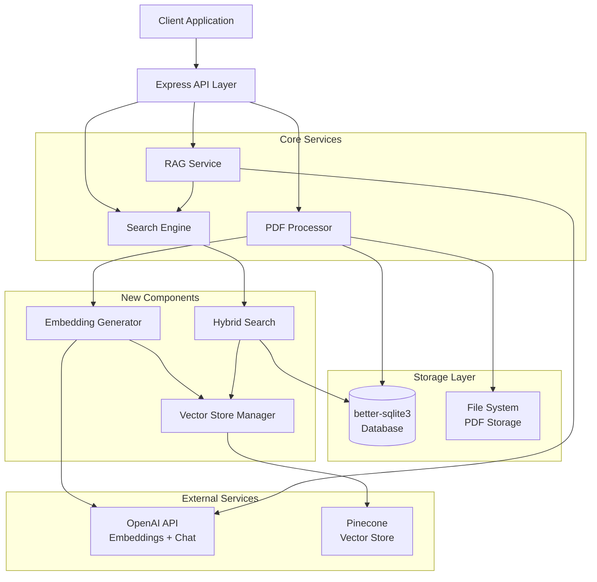

# Design Document: Database and Pinecone Enhancement

## Overview

This design enhances the PDF Q&A Bot with robust database operations and semantic vector search capabilities. The enhancement addresses three critical areas:

1. **Database Migration**: Replace sql.js with better-sqlite3 to fix foreign key constraint violations during transactions
2. **Semantic Search**: Integrate Pinecone vector database with OpenAI embeddings for semantic similarity search
3. **Hybrid Retrieval**: Implement Reciprocal Rank Fusion (RRF) to combine BM25 keyword search with Pinecone semantic search

The design maintains backward compatibility with existing APIs while adding graceful degradation when external services (Pinecone, OpenAI) are unavailable.

## Architecture

### High-Level Architecture



### Component Responsibilities

**Database Manager (db.js)**
- Manages better-sqlite3 connection and initialization
- Enforces foreign key constraints
- Provides synchronous transaction support
- Maintains schema compatibility

**Embedding Generator (embedding-generator.js)**
- Generates embeddings using OpenRouter with openai/text-embedding-3-large model
- Batches requests for efficiency (up to 100 chunks per request)
- Implements retry logic with exponential backoff
- Handles rate limiting gracefully

**Vector Store Manager (vector-store.js)**
- Manages Pinecone client initialization and connection
- Stores embeddings with metadata (document_id, chunk_id, page_number, content_preview)
- Performs vector similarity search
- Handles batch upsert operations (100 vectors per batch)
- Manages embedding deletion on document/chunk removal

**Hybrid Search (hybrid-search.js)**
- Coordinates BM25 and Pinecone searches
- Implements Reciprocal Rank Fusion (RRF) algorithm
- Supports three modes: bm25-only, pinecone-only, hybrid
- Normalizes scores across different search methods
- Falls back gracefully when Pinecone is unavailable

**RAG Service (rag.js)**
- Orchestrates retrieval and answer generation
- Uses Gemini via Langchain for answer generation
- Falls back to extractive mode when Gemini unavailable
- Formats context and prompts for optimal LLM performance

**PDF Processor (pdf-processor.js)**
- Orchestrates document processing pipeline
- Generates embeddings for chunks after database insertion
- Handles asynchronous embedding generation
- Continues processing even if embedding fails

## Components and Interfaces

### Database Manager

**File**: `server/src/db.js`

**Interface**:
```javascript
/**
 * Create and initialize better-sqlite3 database
 * @param {string} dbPath - Optional path to database file
 * @returns {Database} better-sqlite3 database instance
 */
export function createDb(dbPath)
```

**Key Changes**:
- Replace `initSqlJs()` with `new Database(dbPath)`
- Remove manual save operations (better-sqlite3 auto-saves)
- Simplify prepare/run/all methods (native better-sqlite3 API)
- Enable foreign keys with `PRAGMA foreign_keys = ON`

**Implementation Notes**:
- better-sqlite3 is synchronous by design (matches current usage)
- Transactions use `db.transaction(() => { ... })()` pattern
- Foreign key constraints are enforced automatically
- No need for manual serialization/deserialization

### Embedding Generator

**File**: `server/src/services/embedding-generator.js`

**Interface**:
```javascript
/**
 * Generate embeddings for text chunks
 * @param {string[]} texts - Array of text strings to embed
 * @returns {Promise<number[][]>} Array of embedding vectors
 * @throws {Error} If API call fails after retries
 */
export async function generateEmbeddings(texts)

/**
 * Generate embedding for a single text
 * @param {string} text - Text to embed
 * @returns {Promise<number[]>} Embedding vector
 */
export async function generateEmbedding(text)
```

**Configuration**:
- Model: `openai/text-embedding-3-large` via OpenRouter (3072 dimensions)
- Batch size: 100 texts per request
- Retry attempts: 3
- Backoff: Exponential (1s, 2s, 4s)
- Timeout: 30 seconds per request

**Error Handling**:
- Rate limit errors (429): Retry with backoff
- Network errors: Retry with backoff
- Invalid API key: Throw immediately (no retry)
- Other errors: Log and throw after retries

### Vector Store Manager

**File**: `server/src/services/vector-store.js`

**Interface**:
```javascript
/**
 * Initialize Pinecone client
 * @returns {Promise<Pinecone|null>} Pinecone client or null if not configured
 */
export async function initPinecone()

/**
 * Store chunk embeddings in Pinecone
 * @param {Array<{id: number, embedding: number[], metadata: object}>} vectors
 * @returns {Promise<void>}
 */
export async function upsertVectors(vectors)

/**
 * Search for similar vectors
 * @param {number[]} queryEmbedding - Query vector
 * @param {number} topK - Number of results
 * @param {object} filter - Metadata filter (e.g., {document_id: 123})
 * @returns {Promise<Array<{id: string, score: number, metadata: object}>>}
 */
export async function searchVectors(queryEmbedding, topK, filter)

/**
 * Delete vectors by IDs
 * @param {string[]} ids - Vector IDs to delete
 * @returns {Promise<void>}
 */
export async function deleteVectors(ids)

/**
 * Delete all vectors for a document
 * @param {number} documentId
 * @returns {Promise<void>}
 */
export async function deleteDocumentVectors(documentId)

/**
 * Check if Pinecone is configured and connected
 * @returns {Promise<{configured: boolean, connected: boolean}>}
 */
export async function checkStatus()
```

**Metadata Schema**:
```javascript
{
  document_id: number,      // Foreign key to documents table
  chunk_id: number,         // Foreign key to chunks table (used as vector ID)
  page_number: number,      // Page number in PDF
  content_preview: string   // First 500 chars of chunk content
}
```

**Implementation Notes**:
- Vector ID format: `chunk_${chunk_id}` (e.g., "chunk_42")
- Batch upsert: 100 vectors per request
- Namespace: Use default namespace (empty string)
- Index type: Assumes pre-created index with 1536 dimensions, cosine similarity

### Hybrid Search

**File**: `server/src/services/hybrid-search.js`

**Interface**:
```javascript
/**
 * Perform hybrid search combining BM25 and Pinecone
 * @param {object} db - Database instance
 * @param {number} documentId - Document to search
 * @param {string} query - Search query
 * @param {number} topK - Number of results to return
 * @param {string} mode - Search mode: 'bm25', 'pinecone', 'hybrid'
 * @returns {Promise<Array<{chunk_id: number, score: number, content: string, page_number: number}>>}
 */
export async function hybridSearch(db, documentId, query, topK, mode)

/**
 * Reciprocal Rank Fusion algorithm
 * @param {Array<Array<{id: any, score: number}>>} rankedLists - Multiple ranked result lists
 * @param {number} k - RRF constant (default: 60)
 * @returns {Array<{id: any, score: number}>} Merged and re-ranked results
 */
export function reciprocalRankFusion(rankedLists, k = 60)
```

**RRF Algorithm**:
```
For each result in each ranked list:
  RRF_score = sum over all lists of: 1 / (k + rank)
  
Where:
  - k = 60 (standard RRF constant)
  - rank = position in list (1-indexed)
```

**Search Mode Behavior**:
- `bm25`: Use only BM25 search from SQLite
- `pinecone`: Use only Pinecone vector search (requires embeddings)
- `hybrid`: Combine both with RRF, fall back to BM25 if Pinecone unavailable

**Score Normalization**:
- BM25 scores: Normalize by dividing by max score in result set
- Pinecone scores: Already normalized (cosine similarity 0-1)
- RRF scores: Normalize final scores to 0-1 range

### PDF Processor Updates

**File**: `server/src/services/pdf-processor.js`

**Key Changes**:
```javascript
// After inserting chunks and building BM25 index:
// 1. Generate embeddings for all chunks
const chunkTexts = savedChunks.map(c => c.content);
const embeddings = await generateEmbeddings(chunkTexts);

// 2. Prepare vectors for Pinecone
const vectors = savedChunks.map((chunk, i) => ({
  id: `chunk_${chunk.id}`,
  embedding: embeddings[i],
  metadata: {
    document_id: documentId,
    chunk_id: chunk.id,
    page_number: chunk.page_number,
    content_preview: chunk.content.slice(0, 500)
  }
}));

// 3. Upsert to Pinecone (with error handling)
try {
  await upsertVectors(vectors);
} catch (err) {
  console.error('Failed to store embeddings:', err);
  // Continue - document is still usable with BM25
}
```

**Transaction Handling**:
```javascript
// Use better-sqlite3 transaction API
const insertAll = db.transaction((chunks) => {
  for (const chunk of chunks) {
    insertChunk.run(
      documentId,
      chunk.chunk_index,
      chunk.content,
      chunk.page_number,
      chunk.start_offset,
      chunk.end_offset,
      'text'
    );
  }
});

insertAll(chunks); // Execute transaction
```

### RAG Service Updates

**File**: `server/src/services/rag.js`

**Key Changes**:
```javascript
// Replace direct search() call with hybridSearch()
const searchMode = process.env.SEARCH_MODE || 'hybrid';
const results = await hybridSearch(db, documentId, userMessage, 5, searchMode);
```

### RAG Service Updates

**File**: `server/src/services/rag.js`

**Key Changes**:
```javascript
// Replace direct OpenAI call with Gemini via Langchain
import { ChatGoogleGenerativeAI } from "@langchain/google-genai";

const model = new ChatGoogleGenerativeAI({
  modelName: "gemini-1.5-pro",
  apiKey: process.env.GEMINI_API_KEY,
  temperature: 0.7,
  maxOutputTokens: 2048,
});

// Generate answer using Gemini
async function generateWithLLM(question, results) {
  const context = results
    .map((r, i) => `[Source ${i + 1}, Page ${r.page_number}]: ${r.content}`)
    .join('\n\n');

  const prompt = `Based on the following document excerpts, answer the user's question. Cite specific sources using [Page X] references.

Context from document:
${context}

Question: ${question}

Answer:`;

  try {
    const response = await model.invoke(prompt);
    return response.content;
  } catch (err) {
    console.error('Gemini generation failed, falling back to extractive:', err.message);
    return buildExtractiveAnswer(question, results);
  }
}
```

**Dependencies**:
- Add `@langchain/google-genai` package
- Add `langchain` package

## Data Models

### Database Schema (Unchanged)

The existing schema remains compatible:

```sql
CREATE TABLE documents (
  id INTEGER PRIMARY KEY AUTOINCREMENT,
  user_id INTEGER NOT NULL,
  filename TEXT NOT NULL,
  original_name TEXT NOT NULL,
  file_size INTEGER NOT NULL,
  page_count INTEGER DEFAULT 0,
  status TEXT DEFAULT 'processing',
  created_at TEXT DEFAULT (datetime('now')),
  FOREIGN KEY (user_id) REFERENCES users(id) ON DELETE CASCADE
);

CREATE TABLE chunks (
  id INTEGER PRIMARY KEY AUTOINCREMENT,
  document_id INTEGER NOT NULL,
  chunk_index INTEGER NOT NULL,
  content TEXT NOT NULL,
  page_number INTEGER,
  start_offset INTEGER,
  end_offset INTEGER,
  chunk_type TEXT DEFAULT 'text',
  created_at TEXT DEFAULT (datetime('now')),
  FOREIGN KEY (document_id) REFERENCES documents(id) ON DELETE CASCADE
);

CREATE TABLE term_index (
  id INTEGER PRIMARY KEY AUTOINCREMENT,
  term TEXT NOT NULL,
  chunk_id INTEGER NOT NULL,
  tf REAL NOT NULL,
  FOREIGN KEY (chunk_id) REFERENCES chunks(id) ON DELETE CASCADE
);
```

### Pinecone Vector Schema

**Index Configuration**:
- Dimensions: 3072 (openai/text-embedding-3-large via OpenRouter)
- Metric: cosine
- Pod type: Starter or higher

**Vector Format**:
```javascript
{
  id: "chunk_123",              // Unique identifier
  values: [0.1, -0.2, ...],     // 3072-dimensional embedding
  metadata: {
    document_id: 42,
    chunk_id: 123,
    page_number: 5,
    content_preview: "This is the beginning of the chunk..."
  }
}
```

### Environment Variables

```bash
# Existing
PORT=3001
JWT_SECRET=your-secret-key

# New
OPENROUTER_API_KEY=sk-or-...   # OpenRouter API key for embeddings
GEMINI_API_KEY=AIza...         # Google Gemini API key for answer generation
PINECONE_API_KEY=pcsk_...      # Pinecone API key
PINECONE_INDEX_NAME=pdf-qa-bot # Pinecone index name
SEARCH_MODE=hybrid             # Options: bm25, pinecone, hybrid (default: hybrid)
```

### API Response Formats

**Search Status Endpoint** (`GET /api/search/status`):
```javascript
{
  pinecone_configured: boolean,
  pinecone_connected: boolean,
  search_mode: "bm25" | "pinecone" | "hybrid",
  embedding_model: "openai/text-embedding-3-large",
  embedding_provider: "openrouter",
  llm_model: "gemini-1.5-pro",
  llm_provider: "google",
  degraded_mode: boolean,        // true if Pinecone configured but unavailable
  message: string                // Human-readable status
}
```

**Reindex Endpoint** (`POST /api/documents/:id/reindex`):
```javascript
// Request: (empty body)

// Response:
{
  document_id: number,
  chunks_processed: number,
  embeddings_generated: number,
  status: "success" | "partial" | "failed",
  message: string
}
```


## Correctness Properties

A property is a characteristic or behavior that should hold true across all valid executions of a system—essentially, a formal statement about what the system should do. Properties serve as the bridge between human-readable specifications and machine-verifiable correctness guarantees.

### Property 1: Foreign Key Constraint Enforcement

*For any* document upload with chunks, inserting chunks with valid foreign key references to the document should succeed without constraint violations.

**Validates: Requirements 1.2, 1.3**

### Property 2: Embedding Dimension Consistency

*For any* text chunk, the generated embedding vector should have exactly 3072 dimensions (matching openai/text-embedding-3-large model output via OpenRouter).

**Validates: Requirements 2.1**

### Property 3: Embedding Batch Size Limit

*For any* set of chunks being processed, embedding API requests should batch at most 100 texts per request.

**Validates: Requirements 2.4, 10.1**

### Property 4: Vector Metadata Completeness

*For any* chunk embedding stored in Pinecone, the vector metadata should contain all required fields: document_id, chunk_id, page_number, and content_preview.

**Validates: Requirements 3.1**

### Property 5: Content Preview Truncation

*For any* chunk content stored as metadata in Pinecone, the content_preview field should be at most 500 characters in length.

**Validates: Requirements 3.4**

### Property 6: Document Deletion Cleanup

*For any* document that is deleted, all associated embeddings in Pinecone should be deleted as well.

**Validates: Requirements 3.6, 8.1**

### Property 7: Chunk Deletion Cleanup

*For any* chunk that is deleted, the corresponding embedding in Pinecone should be deleted.

**Validates: Requirements 8.2**

### Property 8: Vector ID Format

*For any* chunk embedding stored in Pinecone, the vector ID should be in the format "chunk_{chunk_id}" where chunk_id is the database chunk ID.

**Validates: Requirements 8.3**

### Property 9: Hybrid Search Source Usage

*For any* search query in hybrid mode with Pinecone configured, both BM25 and Pinecone search should be executed.

**Validates: Requirements 4.1**

### Property 10: RRF Score Calculation

*For any* two ranked result lists, applying Reciprocal Rank Fusion should produce scores where each item's score equals the sum of 1/(k + rank) across all lists where it appears (with k=60).

**Validates: Requirements 4.2**

### Property 11: Score Normalization Range

*For any* search results returned by the Search_Engine, all relevance scores should be normalized to the range [0, 1].

**Validates: Requirements 4.5**

### Property 12: Top-K Result Count

*For any* search query with parameter topK=n, the number of results returned should be at most n (or fewer if insufficient matches exist).

**Validates: Requirements 4.6**

### Property 13: Document Upload Resilience

*For any* document upload, the upload should complete successfully and the document should be marked as "ready" even if embedding generation or vector storage fails.

**Validates: Requirements 6.3, 7.6**

### Property 14: Vector Batch Upsert Size

*For any* set of embeddings being stored in Pinecone, upsert operations should batch at most 100 vectors per request.

**Validates: Requirements 10.2**

## Error Handling

### Error Categories

**Configuration Errors** (Fail Fast):
- Missing or invalid PINECONE_API_KEY
- Missing or invalid OPENAI_API_KEY
- Invalid SEARCH_MODE value
- Pinecone index does not exist

**Runtime Errors** (Graceful Degradation):
- Pinecone API unavailable
- OpenAI API unavailable
- Network timeouts
- Rate limiting

### Error Handling Strategy

**Embedding Generation Failures**:
```javascript
try {
  const embeddings = await generateEmbeddings(chunkTexts);
  await upsertVectors(vectors);
} catch (err) {
  console.error(`Embedding generation failed for document ${documentId}:`, err.message);
  // Continue - document is still usable with BM25 search
}
// Always mark document as ready
db.prepare("UPDATE documents SET status = 'ready' WHERE id = ?").run(documentId);
```

**Search Fallback**:
```javascript
async function hybridSearch(db, documentId, query, topK, mode) {
  if (mode === 'hybrid' || mode === 'pinecone') {
    try {
      const pineconeResults = await searchWithPinecone(query, documentId, topK);
      if (mode === 'pinecone') return pineconeResults;
      
      const bm25Results = search(db, documentId, query, topK);
      return reciprocalRankFusion([pineconeResults, bm25Results]);
    } catch (err) {
      console.warn('Pinecone search failed, falling back to BM25:', err.message);
      // Fall through to BM25
    }
  }
  
  // BM25 fallback
  return search(db, documentId, query, topK);
}
```

**Retry Logic with Exponential Backoff**:
```javascript
async function generateEmbeddingsWithRetry(texts, maxRetries = 3) {
  for (let attempt = 0; attempt < maxRetries; attempt++) {
    try {
      return await generateEmbeddings(texts);
    } catch (err) {
      if (err.status === 429 || err.code === 'ECONNRESET') {
        const delay = Math.min(1000 * Math.pow(2, attempt), 60000);
        console.log(`Retry attempt ${attempt + 1} after ${delay}ms`);
        await sleep(delay);
      } else {
        throw err; // Don't retry non-transient errors
      }
    }
  }
  throw new Error('Max retries exceeded');
}
```

**Deletion Cleanup**:
```javascript
// Document deletion should always succeed even if Pinecone cleanup fails
router.delete('/:id', async (req, res) => {
  const doc = db.prepare('SELECT * FROM documents WHERE id = ? AND user_id = ?')
    .get(req.params.id, req.user.id);
  
  if (!doc) return res.status(404).json({ error: 'Document not found' });
  
  // Try to clean up Pinecone (best effort)
  try {
    await deleteDocumentVectors(doc.id);
  } catch (err) {
    console.error(`Failed to delete vectors for document ${doc.id}:`, err.message);
    // Continue with database deletion
  }
  
  // Delete from database (this always succeeds)
  db.prepare('DELETE FROM documents WHERE id = ?').run(doc.id);
  
  // Delete file from disk
  const filePath = path.join(uploadsDir, doc.filename);
  if (fs.existsSync(filePath)) {
    fs.unlinkSync(filePath);
  }
  
  res.json({ message: 'Document deleted' });
});
```

### Error Messages

**Configuration Errors**:
- "PINECONE_API_KEY not configured. Vector search disabled."
- "Invalid SEARCH_MODE: must be 'bm25', 'pinecone', or 'hybrid'"
- "Pinecone index 'pdf-qa-bot' not found. Please create the index first."
- "GEMINI_API_KEY not configured. Using extractive answer mode."

**Runtime Errors**:
- "Pinecone API unavailable. Using BM25 search only."
- "OpenRouter embedding API failed. Document uploaded without semantic search capability."
- "Gemini API unavailable. Using extractive answer mode."
- "Rate limit exceeded. Retrying with exponential backoff..."

## Testing Strategy

### Dual Testing Approach

This feature requires both unit tests and property-based tests to ensure comprehensive coverage:

**Unit Tests**: Verify specific examples, edge cases, error conditions, and integration points
**Property Tests**: Verify universal properties across all inputs using randomized testing

Together, these approaches provide comprehensive coverage where unit tests catch concrete bugs and property tests verify general correctness.

### Property-Based Testing

**Library**: Use `fast-check` for JavaScript property-based testing

**Configuration**: Each property test should run a minimum of 100 iterations to ensure adequate coverage through randomization.

**Test Tagging**: Each property test must include a comment referencing the design document property:
```javascript
// Feature: database-and-pinecone-enhancement, Property 1: Foreign Key Constraint Enforcement
```

### Test Categories

**Database Migration Tests** (Unit):
- Schema compatibility verification
- Foreign key enforcement enabled
- Transaction rollback behavior
- Prepared statement API compatibility

**Embedding Generation Tests** (Unit + Property):
- Unit: Mock OpenRouter API responses for success/failure cases
- Unit: Retry logic with mocked rate limits
- Property: Embedding dimensions are always 3072
- Property: Batch sizes never exceed 100

**Vector Store Tests** (Unit + Property):
- Unit: Mock Pinecone client for success/failure cases
- Unit: Connection status checking
- Property: Metadata completeness for all vectors
- Property: Content preview truncation to 500 chars
- Property: Vector ID format matches "chunk_{id}"

**Hybrid Search Tests** (Unit + Property):
- Unit: Each search mode (bm25, pinecone, hybrid) works correctly
- Unit: Fallback to BM25 when Pinecone unavailable
- Property: RRF algorithm produces correct scores
- Property: Score normalization to [0, 1] range
- Property: Result count respects top-k parameter

**Integration Tests** (Unit):
- End-to-end document upload with embedding generation
- End-to-end search with hybrid mode
- Document deletion with vector cleanup
- Reindex endpoint functionality
- Status endpoint returns correct information

**Error Handling Tests** (Unit):
- Graceful degradation when Pinecone unavailable
- Document upload succeeds despite embedding failures
- Retry logic for transient errors
- No retry for permanent errors (invalid API key)

### Test Data Generation

For property-based tests, use these generators:

```javascript
// Random text chunks
const chunkArbitrary = fc.record({
  content: fc.string({ minLength: 10, maxLength: 2000 }),
  page_number: fc.integer({ min: 1, max: 100 }),
  chunk_index: fc.integer({ min: 0, max: 1000 })
});

// Random embeddings (3072 dimensions for openai/text-embedding-3-large)
const embeddingArbitrary = fc.array(
  fc.float({ min: -1, max: 1 }),
  { minLength: 3072, maxLength: 3072 }
);

// Random search results with scores
const searchResultArbitrary = fc.record({
  id: fc.integer({ min: 1, max: 10000 }),
  score: fc.float({ min: 0, max: 1 })
});

// Ranked lists for RRF testing
const rankedListsArbitrary = fc.array(
  fc.array(searchResultArbitrary, { minLength: 1, maxLength: 20 }),
  { minLength: 2, maxLength: 5 }
);
```

### Mocking Strategy

**OpenRouter API Mock**:
```javascript
const mockOpenRouter = {
  chat: {
    completions: {
      create: vi.fn().mockResolvedValue({
        choices: [{
          message: {
            content: JSON.stringify({
              data: [{ embedding: new Array(3072).fill(0.1) }]
            })
          }
        }]
      })
    }
  }
};
```

**Pinecone Client Mock**:
```javascript
const mockPinecone = {
  index: vi.fn().mockReturnValue({
    upsert: vi.fn().mockResolvedValue({}),
    query: vi.fn().mockResolvedValue({ matches: [] }),
    deleteMany: vi.fn().mockResolvedValue({})
  })
};
```

**Database Mock** (for isolated tests):
```javascript
const mockDb = {
  prepare: vi.fn().mockReturnValue({
    run: vi.fn().mockReturnValue({ changes: 1, lastInsertRowid: 1 }),
    get: vi.fn().mockReturnValue({}),
    all: vi.fn().mockReturnValue([])
  }),
  transaction: vi.fn(fn => fn)
};
```

### Test Execution

Run tests with:
```bash
npm test                          # Run all tests
npm test -- --coverage           # Run with coverage report
npm test -- --watch              # Run in watch mode
npm test -- pdf-processor.test.js # Run specific test file
```

Expected coverage targets:
- Line coverage: > 80%
- Branch coverage: > 75%
- Function coverage: > 85%
